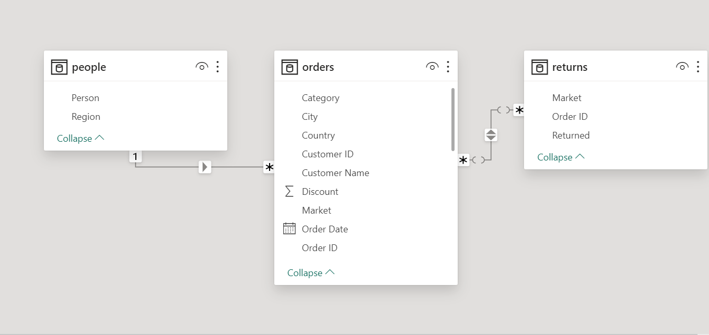
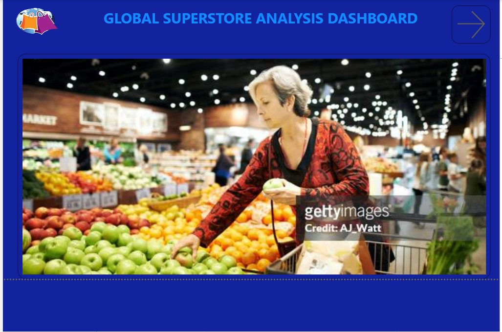
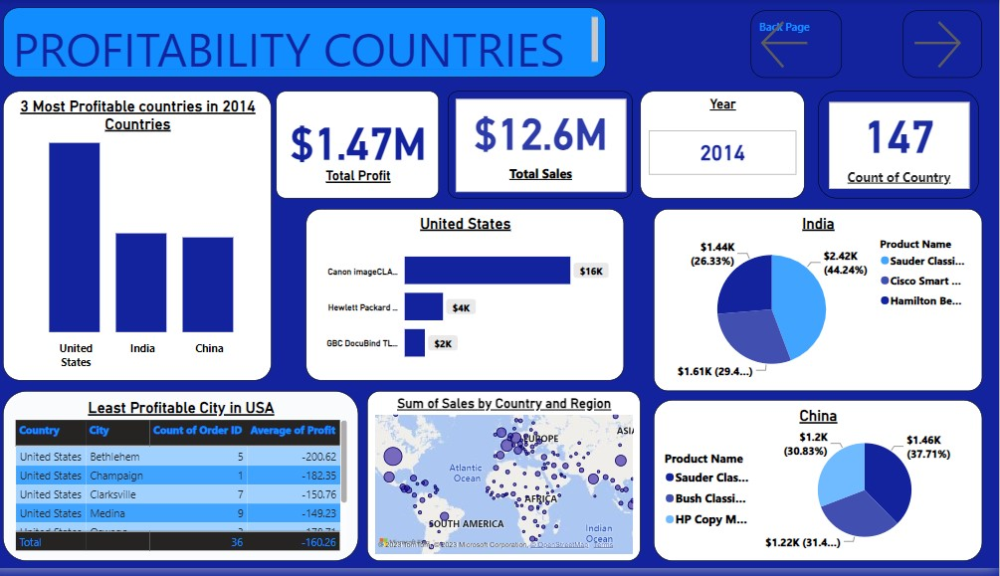
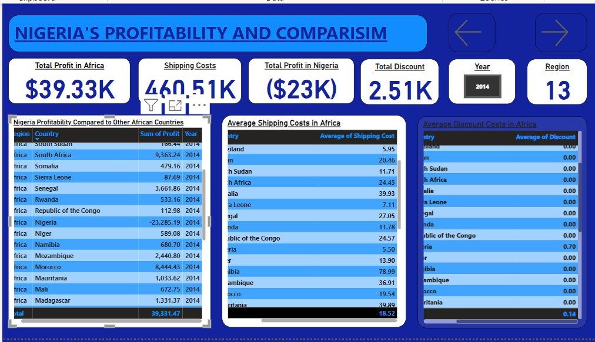
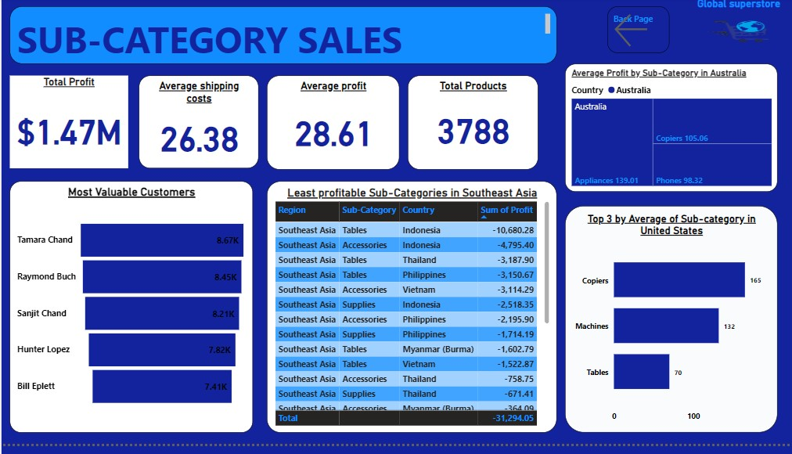

# Global-Superstore-Project-1 🏪

As a dedicated data analyst, I am eager to assist Global Superstore in analyzing and extracting valuable insights from the Superstore dataset. The goal is to provide management with the necessary information to make informed decisions, ultimately enhancing overall performance and profitability.

---

## Introduction 👋

In this project, I will be diving into the financial and operational data of **Global Superstore** for the year 2014.
Using a combination of data exploration and analytical methods, the goal is to reveal valuable insights and patterns within the dataset. The inquiries cover diverse areas such as country-specific profitability, shipping expenses, subcategories of products, customer tendencies, and geographical trends. The findings from this analysis will provide a comprehensive view of the company's performance, offering insights that can guide informed decisions for improving operations and boosting profitability.

**_Disclaimer_**: _The datasets and reports presented herein are purely illustrative and do not reflect the data of any specific institution or organization. They are simulated datasets created solely for the purpose of showcasing the capabilities of Microsoft Power BI._

---

## Problem Statement ❓

* Question 1
a) What are the three countries that generated the highest total profit for Global Superstore in 2014?
b) For each of these three countries, find the three products with the highest total profit. Specifically, what are the products’ names and the total profit for each product?

* Question 2
a) Identify the 3 subcategories with the highest average shipping cost in the United States.

* Question 3
a) Assess Nigeria’s profitability (i.e., total profit) for 2014. How does it compare to other African
countries?
b) What factors might be responsible for Nigeria’s poor performance? You might want to investigate
shipping costs and the average discount as potential root causes.

* Question 4
a) Identify the product subcategory that is the least profitable in Southeast Asia.
Note: For this question, assume that Southeast Asia comprises Cambodia, Indonesia, Malaysia, Myanmar
(Burma), the Philippines, Singapore, Thailand, and Vietnam.
b) Is there a specific country i n Southeast Asia where Global Superstore should stop offering the
subcategory identified in 4a?

* Question 5
a) Which city is the least profitable (in terms of average profit) in the United States? For this analysis,
discard the cities with less than 10 orders. b) Why is this city’s average profit so low?

* Question 6
a) Which product subcategory has the highest average profit in Australia?

* Question 7
a) Who are the most valuable customers, and what do they purchase?
---

## Data Sourcing ℹ️
The datasets consist of three sheets:

- Orders with 51,290 rows and 24 columns
- People with 13 rows and 2 columns
- Returns with 1173 and 3 columns
---

## Skills and Concepts Demonstrated 📋

The following PowerBI features were incorporated:
* Power Query
* Data Modeling
* Data Cleaning
* Quick Measures
* Page navigation
* Data Visualization
* DAX (Data Analysis Expression)
* Buttons and Toolips
---

## Modelling ⭐

I employed a star schema for my data modeling approach

---

## Visualizations 📈

The dashboard includes:

- Home Page 
  

- Profitable and Non-profitable Countries 
  

- Nigerian Profitability and Comparison 
     

  -  Sub-Categories 
     
---

 ## Recommendations ✔️
 
   - Focus on expanding market presence in the United States, India, and China, as these countries generate the highest total profit also tailor marketing strategies and product offerings to cater to the preferences of customers in these three countries
   
   - Consider offering free shipping or discounted shipping rates for these product subcategories in the United States.

   - Consider implementing targeted marketing campaigns to increase brand awareness and attract new customers in Nigeria.
   
   -  Consider adjusting pricing, marketing strategies, or product offerings for copiers in Thailand based on market-specific insights.
   
   - Further investigate the reasons behind the low average profit in Yuma of -$116.50, such as customer demographics and the competitive landscape. Also, develop strategies to improve profitability in Yuma, such as targeted promotions, localized marketing, or partnerships with local businesses.
   
  - Capitalize on the high profitability of Appliances ($139.01) in Australia by expanding product offerings, enhancing marketing efforts, and exploring partnerships with Australian furniture retailer
   
   - Implement a customer relationship management (CRM) system to track customer purchase history, preferences, and demographics, and also utilize customer data to identify and target high-value customers with personalized marketing campaigns and exclusive offers.
---

## Additional Information ℹ️

   - Enhance the e-commerce platform and user experience to improve customer satisfaction and conversion rates.
   
   - Regularly monitor and analyze market trends, competitor activities, and customer feedback to stay ahead of the curve and make timely adjustments to strategies.
---

## Conclusion 👇

The analysis and recommendations provided in this report have addressed various aspects of Global Superstore's business, including customer profitability, product performance, shipping costs, and marketing strategies. By implementing the suggested recommendations, Global Superstore can optimize its operations, strengthen its market position, and achieve sustainable growth in the competitive e-commerce landscape.

As Global Superstore continues to grow and evolve, data analytics will remain a crucial tool for driving informed decision-making and achieving strategic objectives. By continuously gathering, analyzing, and interpreting data, Global Superstore can gain a deeper understanding of its customers, market trends, and competitive dynamics, enabling it to navigate challenges, seize opportunities, and establish itself as a leader in the global online retail industry.

---

## Thank You 😄
  

## You can contact me via LinkedIn [here](linkedin.com/in/ruth-omoizirein)
